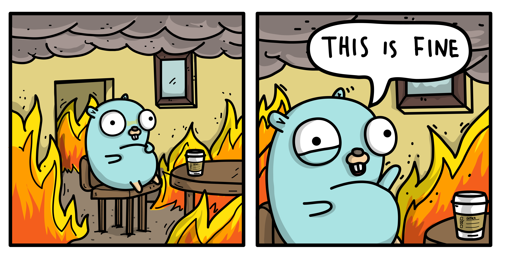

<!-- markdownlint-disable MD033 MD041 -->
<p></p>
<!-- markdownlint-enable MD033 MD041 -->

# Golang build utils

<!-- markdownlint-disable MD033 MD041 MD051 -->
<div>
  <h4 align="center">
    
    
    
    
  </h4>
</div>

<div align="center">


</div>

<div align="center"> <sub> Gopher Art под авторством <a href="https://GitHub.com/ashleymcnamara/gophers">Ashley McNamara</a>. </sub> </div>
<!-- markdownlint-enable MD033 -->

## Description

Среда для сборки контейнера с зависимостями для Golang. Основан на [сборочных компонентах Google](https://go.googlesource.com/build/+/refs/heads/master/) и таблице соотношения [Debian-Astra](https://wiki.astralinux.ru/pages/viewpage.action?pageId=53646577)

::include{file=docs/integration.md}

## Contents

- [Golang build utils](#golang-build-utils)
  - [Description](#description)
  - [Contents](#contents)
  - [What is it](#what-is-it)
  - [How to work with](#how-to-work-with)
    - [Build variables](#build-variables)
  - [Assembly concept](#assembly-concept)
    - [Assembly requirements](#assembly-requirements)
    - [Assembly variables](#assembly-variables)
    - [How test local](#how-test-local)
  - [Issues and solutions](#issues-and-solutions)
  - [How to install it](#how-to-install-it)

## [What is it](#contents)

Среда для сборки Golang, на основе отечественной ОС AstraLinux

## [How to work with](#contents)

Для начала работы необходимо установить [pre-commit](https://pre-commit.com/) и хуки

```console
$ pip install pre-commit
$ pre-commit --version

pre-commit 4.2.0

$ pre-commit install

pre-commit installed at .git/hooks/pre-commit
pre-commit installed at .git/hooks/commit-msg
pre-commit installed at .git/hooks/pre-push
```

>>> [!warning] Предупреждение

- Чтобы проверить свои изменения, воспользуйтесь командой `pre-commit run --all-files`
- Чтобы проверить конкретную задачу, воспользуетесь командой `pre-commit run <target> --all-files`
- Если Вы понимаете что творите и хотите пропустить проверку `pre-commit`-ом воспользуйтесь `--no-verify`, пример `git commit -m "Добавил изменения и не хочу проверки" --no-verify`
>>>

Собрать образ `Astra Linux based`

```shell
## Export Golang build utils version
export ASTRA_VERSION='1.7.5'
export GOLANG_BUILD_UTILS_VERSION="1.0.0-astra${ASTRA_VERSION}"

## Golang build utils image: 952MB
docker build \
    --progress=plain \
    --no-cache \
    -t golang-build-utils:"${GOLANG_BUILD_UTILS_VERSION}" \
    .
```

### [Build variables](#contents)

| Имя              | Значение по умолчанию |  Тип   |                                                                                    Описание |
| :--------------- | :-------------------: | :----: | ------------------------------------------------------------------------------------------: |
| `image_registry` |          ''           | string | Адрес до реестра образа. Например: `--build-arg image_registry=my-container-registry:1111/` |
| `image_name`     |         astra         | string |                                                                                 Имя образа. |
| `image_version`  |         1.7.5         | string |                                                                              Версия образа. |

## [Assembly concept](#contents)

Представление [Makefile-а](init/Makefile.default.mk), который используется в CI-е
Представление [Makefile-а](init/Makefile.svace.mk), который используется в Svace

### [Assembly requirements](#contents)

>>> [!note] Особенности сборки
Минимальная требуемая версия Go bootstrap зависит от целевой версии Go, которую необходимо собрать из исходного кода

- Go <= 1.4: набор инструментов для языка C.
- 1.5 <= Go <= 1.19: компилятор Go 1.4.
- 1.20 <= Go <= 1.21: компилятор Go 1.17.
- 1.22 <= Go <= 1.23: компилятор Go 1.20.
- В дальнейшем Go версии 1.N потребует компилятор Go 1.M, где M — это N-2, округленное до четного числа. Пример: Go 1.24 и 1.25 требуют Go 1.22.
>>>

Допустимые комбинации `$GOOS` и `$GOARCH`:

|  `$GOOS`  | `$GOARCH` |
| :-------: | :-------: |
|    aix    |   ppc64   |
|  android  |    386    |
|  android  |   amd64   |
|  android  |    arm    |
|  android  |   arm64   |
|  darwin   |   amd64   |
|  darwin   |   arm64   |
| dragonfly |   amd64   |
|  freebsd  |    386    |
|  freebsd  |   amd64   |
|  freebsd  |    arm    |
|  illumos  |   amd64   |
|    ios    |   arm64   |
|    js     |   wasm    |
|   linux   |    386    |
|   linux   |   amd64   |
|   linux   |    arm    |
|   linux   |   arm64   |
|   linux   |  loong64  |
|   linux   |   mips    |
|   linux   |  mipsle   |
|   linux   |  mips64   |
|   linux   | mips64le  |
|   linux   |   ppc64   |
|   linux   |  ppc64le  |
|   linux   |  riscv64  |
|   linux   |   s390x   |
|  netbsd   |    386    |
|  netbsd   |   amd64   |
|  netbsd   |    arm    |
|  openbsd  |    386    |
|  openbsd  |   amd64   |
|  openbsd  |    arm    |
|  openbsd  |   arm64   |
|   plan9   |    386    |
|   plan9   |   amd64   |
|   plan9   |    arm    |
|  solaris  |   amd64   |
|  wasip1   |   wasm    |
|  windows  |    386    |
|  windows  |   amd64   |
|  windows  |    arm    |
|  windows  |   arm64   |

### [Assembly variables](#contents)

Данные переменные могут использоваться как для локальной сборки, так и для сборки через CI. Данные переменные применимы и оказывают эффект на [скрипт](init/go-builder.sh). Данный скрипт работает в двух режимах:

- Обеспечивает сборку набора ПО для компиляции Golang-a старших версий/поколений(далее **bootstrap**)
- Сборка бинарного файла `go` и `gofmt`

| Имя                                                  |     Значение по умолчанию      |    Тип     |                                                                                                                                                                                                                                                                            Описание |
| :--------------------------------------------------- | :----------------------------: | :--------: | ----------------------------------------------------------------------------------------------------------------------------------------------------------------------------------------------------------------------------------------------------------------------------------: |
| `GOLANG_BUILD_ENTITY`                                |    `${CI_COMMIT_REF_NAME}`     | stringspec |                                                                                                              Ветка/тег собираемого интерпретатора. Если не указно, то использует [предопределенные переменные GitLab-a](https://docs.gitlab.com/ci/variables/predefined_variables). |
| `GOLANG_IS_BOOTSTRAP`                                |               ''               |   string   | Проверка, является ли данная сборка bootstrap-ом. Если указано `true`, то происходит кросс-компиляция цепочки инструментов для этой `GOOS/GOARCH` сборки. В дальнейшем, этот набор инструментов используется как компилятор для [старших поколений golang](#assembly-requirements). |
| `GOOS`                                               | [тут](init/go-builder.sh#L448) |   string   |                                                                                                                                                                                       Тип ОС, если не будет указано/предустановлено иное, будет использовано значение по умолчанию. |
| `GOARCH`                                             | [тут](init/go-builder.sh#L449) |   string   |                                                                                                                                                                               Архитектура ОС, если не будет указано/предустановлено иное, будет использовано значение по умолчанию. |
| `DEBUG`                                              |               ''               |   string   |                                                                                                                                                                     Включить режим отладки для входной точки. Установите переменную как `-e DEBUG=ON` чтобы включить режим отладки. |
| `PUBLISH_REGISTRY_UPLOAD_URL`                        |               ''               |   string   |                                                                                                                                                                    Относится к шаблону загрузки артефактов. Корневой URL до реестра артефактов. Пример: `https://my-registry:8118`. |
| `PUBLISH_REGISTRY_UPLOAD_REPOSITORY_NAME`            |               ''               |   string   |                                                                                                                                                                                Относится к шаблону загрузки артефактов. Имя репозитория реестра, куда будет сложен артефакт сборки. |
| `PUBLISH_REGISTRY_UPLOAD_DESTINATION_DIRECTORY_NAME` |               ''               |   string   |                                                                                                                                                                         Относится к шаблону загрузки артефактов. Имя вложенности внутри реестра, куда будет сложен артефакт сборки. |

### [How test local](#contents)

1. Склонировать репозиторий с компилятором
2. Войти в интерактивную среду данного образа: `docker run -it --rm -v "$(pwd):/build" -w /build golang-build-utils:1.0.0-astra1.7.5 bash`
3. Объявить [необходимые](#assembly-variables) переменные, чтобы сформировать окружение для работы скрипта
4. Запустить сборщик: `go-builder`

Пример запуска сборщика

```shell
export GOLANG_BUILD_ENTITY='release-branch.go1.4'
export GOLANG_IS_BOOTSTRAP=true
export PUBLISH_REGISTRY_UPLOAD_URL='https://my-registry:8118'
export PUBLISH_REGISTRY_UPLOAD_REPOSITORY_NAME='golang-bootstrap'
export PUBLISH_REGISTRY_UPLOAD_DESTINATION_DIRECTORY_NAME='golang'
go-builder
```

## [Issues and solutions](#contents)

> [!caution] Негативное влияние тестов
> При сборке golang в режиме `all.bash`(где проходят и тесты) существует данная ошибка. По сути, это не ошибка, а проблема в тех, кто пишет эти тесты. Дело в том, что они 'встраивают' [как хендшейки, так и серты внутрь](https://go.googlesource.com/go/+/refs/heads/master/src/crypto/tls/handshake_test.go), проводят их [проверку](https://go.googlesource.com/go/+/refs/heads/master/src/crypto/tls/handshake_client_test.go#1567), что приводит к их невозможности выполнения, из-за разности в датах. Решением проблемы может послужить ЯВНОЕ ИГНОРИРОВАНИЕ тестов или запуск `make.bash`, что тождественно равно в обоих случаях.

- Альтернативное и, пожалуй, эффективное средство использовать [патчи](init/patches/) на нашей стороне

```plaintext
# https://github.com/golang/go/issues/71077
--- FAIL: TestVerifyConnection (0.01s)
    --- FAIL: TestVerifyConnection/TLSv12 (0.00s)
        handshake_client_test.go:1721: RequireAndVerifyClientCert-FullHandshake: handshake failed: remote error: tls: bad certificate
    --- FAIL: TestVerifyConnection/TLSv13 (0.01s)
        handshake_client_test.go:1721: RequireAndVerifyClientCert-FullHandshake: handshake failed: remote error: tls: bad certificate
--- FAIL: TestResumptionKeepsOCSPAndSCT (0.00s)
    --- FAIL: TestResumptionKeepsOCSPAndSCT/TLSv12 (0.00s)
        handshake_client_test.go:2512: handshake failed: remote error: tls: bad certificate
    --- FAIL: TestResumptionKeepsOCSPAndSCT/TLSv13 (0.00s)
        handshake_client_test.go:2512: handshake failed: remote error: tls: bad certificate
FAIL
FAIL    crypto/tls      0.947s

# https://github.com/golang/go/issues/68564
--- FAIL: TestCrossVersionResume (0.02s)
    --- FAIL: TestCrossVersionResume/TLSv12 (0.01s)
        handshake_server_test.go:526: handshake did not resume at the same version
    --- FAIL: TestCrossVersionResume/TLSv13 (0.01s)
        handshake_server_test.go:526: handshake did not resume at the same version
FAIL
FAIL    crypto/tls    0.713s
```

- Периодически возникающая ошибка. Может означать повышенную нагрузку на стенды. Она временного характера и не является ошибкой сборки

```plaintext
# https://github.com/golang/go/issues/67599
--- FAIL: TestLongAdjustTimers (8.69s)
    tick_test.go:226: failed to read work, iteration 10274
FAIL
FAIL time 41.078s
```

## [How to install it](#contents)

> [!warning] Предупреждение
> Скачиванию подлежат артефакты, без окончания `*-bootstrap.tgz`
<!-- markdownlint-disable-line MD028 -->
>>> [!tip] Шаги по установке продукта

1. Скачать необходимый компилятор из реестра артефактов
2. Удалить старые бинарные файлы и экспортировать новые `rm -rf /usr/local/go && tar -C /usr/local -xzf go1.24.1-linux-amd64.tgz`
3. Добавить новый бинарный файл в переменные среды `export PATH="${PATH}:/usr/local/go/bin"`
4. Проверить версию установленного бинарного файла `go version`
>>>

Пример:

```shell
## Удаляем старую версию Golang-a
rm -rf /usr/local/go

## Скачиваем артефакт
curl --silent \
    https://example.registry.com/golang/go1.24.1-linux-amd64.tgz | tar -C "/usr/local" -zx

## Обновляем переменные среды
export PATH="${PATH}:/usr/local/go/bin"

## В качестве проверки проверяем версию продукта
go version

## Попробуем установить пакет
go install golang.org/x/tools/gopls@latest
```

::include{file=docs/cya.md}
